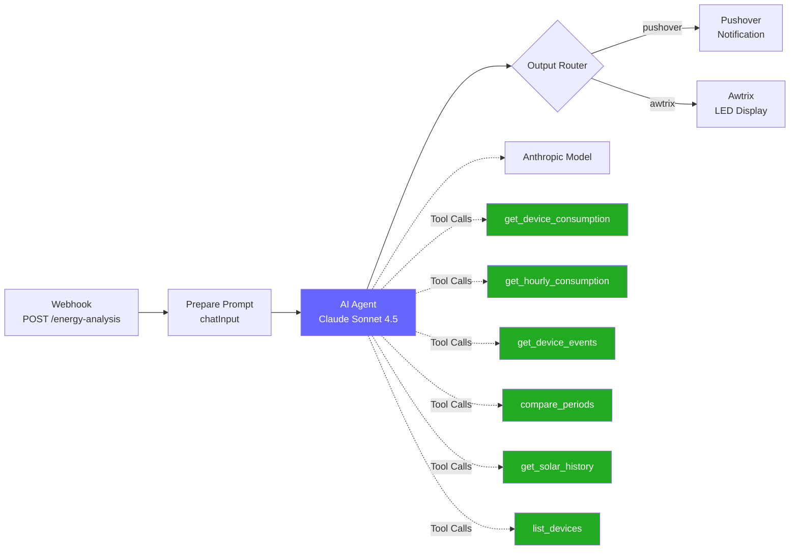

# MyTapo Report API - Endpoints & Workflows

## API Endpoints

Base URL: `http://<host>:8099`

### Report Endpoints (fuer direkte Abfragen und n8n Workflow 1)

| Endpoint | Methode | Parameter | Beschreibung |
|----------|---------|-----------|--------------|
| `/health` | GET | - | Health Check |
| `/reports` | GET | - | Liste aller Endpoints |
| `/reports/today` | GET | - | Heutiger Verbrauch aller Geraete |
| `/reports/top-devices` | GET | `?period=day\|week\|month` | Top-Verbraucher sortiert |
| `/reports/events` | GET | `?period=day\|week\|month` | Waschmaschine/Trockner Events |
| `/reports/solar` | GET | - | Solarertrag heute + Woche |
| `/reports/comparison` | GET | `?period=day\|week\|month` | Vergleich mit Vorperiode |
| `/reports/custom` | POST | `{"question": "..."}` | Datenkontext fuer AI-Analyse |

### Tool Endpoints (fuer AI Agent - Workflow 2)

Flexible Zeitraum-Abfragen, die der AI Agent dynamisch aufrufen kann.

| Endpoint | Methode | Parameter | Beschreibung |
|----------|---------|-----------|--------------|
| `/tools/device_consumption` | GET | `?device=`, `?start=`, `?end=`, `?days=` | Verbrauch pro Geraet/Zeitraum |
| `/tools/hourly_consumption` | GET | `?date=`, `?device=` | Stuendliche Aufschluesselung |
| `/tools/device_events` | GET | `?device=`, `?days=`, `?start=`, `?end=` | Geraete-Events (Waschgaenge etc.) |
| `/tools/compare_periods` | GET | `?period_a_start=`, `?period_a_end=`, `?period_b_start=`, `?period_b_end=`, `?device=` | Zwei Zeitraeume vergleichen |
| `/tools/solar_history` | GET | `?start=`, `?end=`, `?days=` | Solar-Erzeugung historisch |
| `/tools/list_devices` | GET | - | Alle ueberwachten Geraete auflisten |

### Parameter-Details

#### Zeitraum-Parameter (Tool Endpoints)

| Parameter | Format | Beispiel | Beschreibung |
|-----------|--------|----------|--------------|
| `start` | ISO-Datum | `2026-03-01` | Startdatum des Zeitraums |
| `end` | ISO-Datum | `2026-03-06` | Enddatum (Default: jetzt) |
| `days` | Integer | `7` | Alternative: Tage zurueck ab jetzt |
| `date` | ISO-Datum | `2026-03-06` | Bestimmter Tag (hourly-consumption) |
| `device` | String | `washing_machine` | Geraetefilter (optional) |

> **Hinweis:** `days` und `start`/`end` sind Alternativen. Wird `days` angegeben, werden `start`/`end` ignoriert. Ohne beides wird der heutige Tag abgefragt.

#### Period-Parameter (Report Endpoints)

| Wert | Zeitraum |
|------|----------|
| `day` | Letzter Tag (Default) |
| `week` | Letzte 7 Tage |
| `month` | Letzte 30 Tage |

---

## n8n Workflows

### Workflow 1: Energy Report On-Demand

**Webhook:** `POST /webhook/energy-report`

| Body-Parameter | Default | Optionen |
|----------------|---------|----------|
| `report_type` | `today` | `today`, `top-devices`, `events`, `solar`, `comparison` |
| `period` | `day` | `day`, `week`, `month` |
| `output` | `pushover` | `pushover`, `awtrix` |

### Workflow 2: AI Energy Analysis

**Webhook:** `POST /webhook/energy-analysis`

| Body-Parameter | Default | Optionen |
|----------------|---------|----------|
| `question` | Zusammenfassung des heutigen Verbrauchs | Freitext |
| `output` | `pushover` | `pushover`, `awtrix` |

### Workflow 3: Weekly AI Summary

**Trigger:** Schedule (Sonntag 20:00 Uhr)
**Output:** Pushover

---

## Workflow-Diagramm

### Workflow 2: AI Energy Analysis (Tool-basiert)

Der AI Agent entscheidet selbst, welche Daten er braucht, und kann flexible Zeitraeume abfragen. Tool-Nodes verwenden `httpRequestTool` v4.3 mit `$fromAI()` Expressions. Jede Ausfuehrung bekommt eine eigene Session-ID (kein persistenter Memory-Kontext).