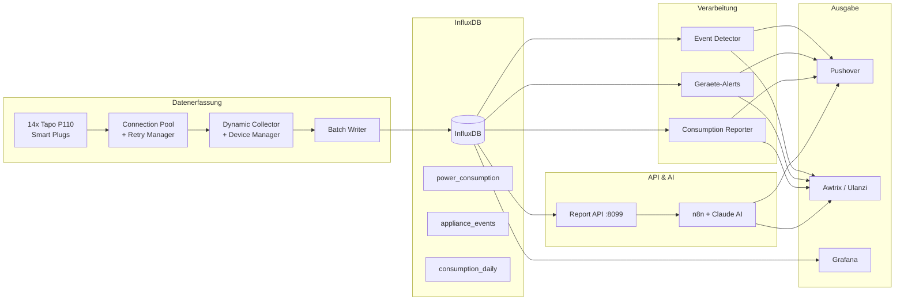
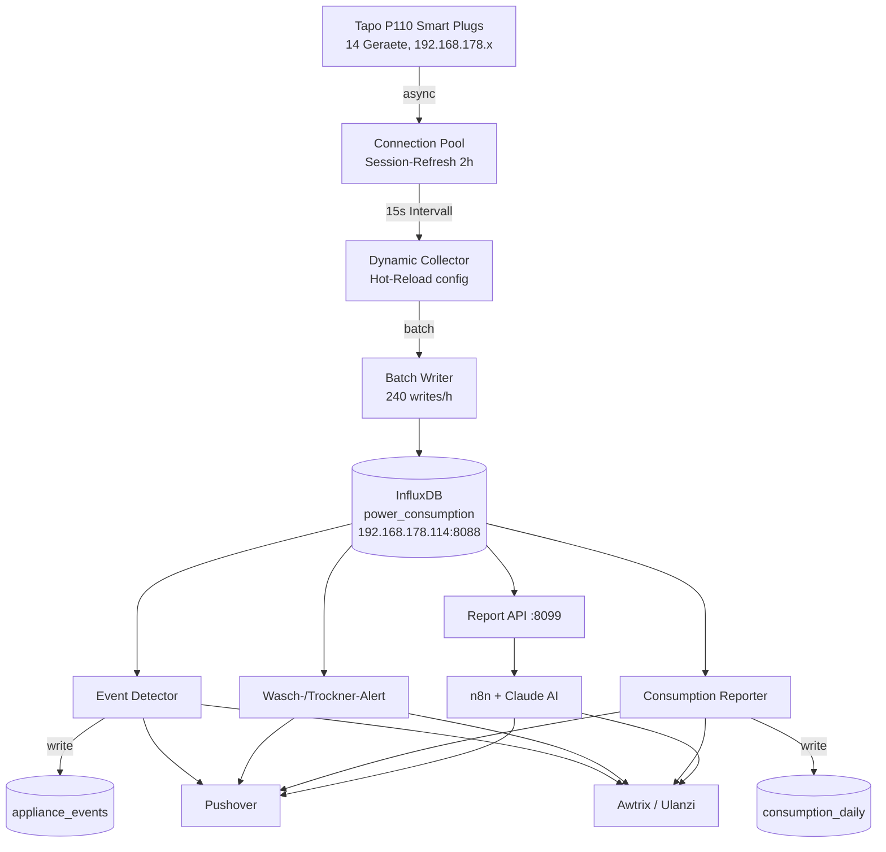
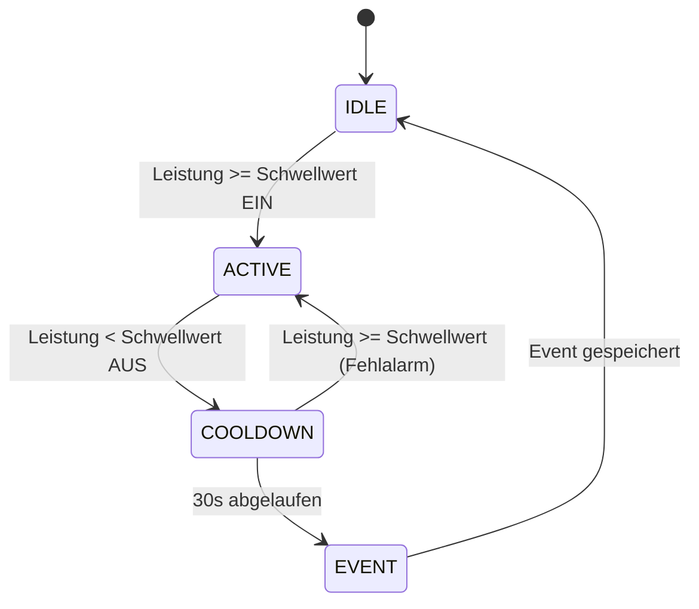
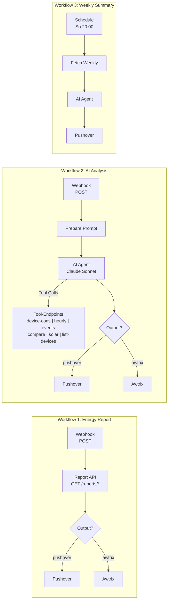
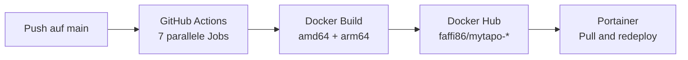

# MyTapo - Smart Home Energiemonitoring System

## Ueberblick

MyTapo ist ein umfassendes Energiemonitoring-System fuer den Haushalt, basierend auf **14 Tapo P110 Smart Plugs**. Das System erfasst den Stromverbrauch aller angeschlossenen Geraete in Echtzeit, erkennt automatisch Geraetenutzungen (z.B. Waschgaenge, Espressozubereitungen), und liefert intelligente Benachrichtigungen sowie AI-gestuetzte Analysen.

### Kernfunktionen

- **Echtzeit-Datenerfassung**: Polling aller 14 Geraete alle 15 Sekunden
- **Event-Erkennung**: Automatische Erkennung von Geraetenutzungen (Waschmaschine, Trockner, Espresso, TV, etc.)
- **Intelligente Benachrichtigungen**: Push-Nachrichten via Pushover und LED-Lauftext auf Ulanzi Pixel Clock
- **AI-Analyse**: Natuerlichsprachliche Energieabfragen ueber n8n + Claude
- **Reporting**: Tages-, Wochen- und Monatsberichte mit Diagrammen
- **Solar-Monitoring**: Tracking der Solarstrom-Erzeugung mit Ertragsanzeige

---

## Architektur

### Technologie-Stack

| Komponente | Technologie |
|-----------|-------------|
| Sprache | Python 3.13 |
| Paketmanager | Poetry / uv |
| Datenbank | InfluxDB (Zeitreihen) |
| Display | Awtrix (Ulanzi Smart Pixel Clock) |
| Benachrichtigungen | Pushover API |
| Workflow-Automatisierung | n8n |
| AI-Analyse | Claude (Anthropic) via n8n |
| Deployment | Docker Compose |
| CI/CD | GitHub Actions → Docker Hub |
| Visualisierung | Grafana |

### Ueberwachte Geraete

| Geraet | IP-Adresse | Beschreibung |
|--------|-----------|--------------|
| solar | 192.168.178.61 | Solaranlage (Erzeugung) |
| washing_machine | 192.168.178.52 | Waschmaschine |
| washing_dryer | 192.168.178.54 | Trockner |
| cooler | 192.168.178.86 | Kuehlschrank |
| living_room_window | 192.168.178.75 | Steckdose Wohnzimmerfenster |
| kitchen | 192.168.178.74 | Kuechensteckdose |
| bedroom | 192.168.178.60 | Schlafzimmer |
| television | 192.168.178.58 | Fernseher |
| office | 192.168.178.55 | Buero 1 |
| office2 | 192.168.178.121 | Buero 2 |
| bathroom | 192.168.178.120 | Badezimmer |
| hwr_charger | 192.168.178.104 | E-Bike Ladegeraet |
| kaffe_bar | 192.168.178.91 | Kaffeemaschine |
| network_nas | 192.168.178.122 | NAS + Netzwerk |

### Gesamtarchitektur



---

## Datenfluss

### Datenfluss-Diagramm



### 1. Datenerfassung

Der primaere Datensammler (`tapo_influx_consumption_dynamic.py`) pollt alle aktivierten Geraete im 15-Sekunden-Takt:

1. **Tapo API** → Asynchrone Abfrage der aktuellen Leistung (Watt) pro Geraet
2. **Batch Writer** → Sammelt alle 14 Messwerte und schreibt sie gebuendelt nach InfluxDB
3. **Hot-Reload** → Geraetekonfiguration (`config/devices.json`) wird per File-Watcher ueberwacht und bei Aenderung sofort neu geladen

**Optimierungen:**
- Connection Pooling (Tapo API Clients werden wiederverwendet)
- Session-Refresh alle 2 Stunden (verhindert Timeouts)
- Batch-Schreibvorgaenge (90% weniger InfluxDB-Verbindungen: 240/h statt 3.120/h)

### 2. Datenspeicherung (InfluxDB)

| Bucket | Inhalt | Schreiber |
|--------|--------|-----------|
| `power_consumption` | Rohe Leistungsdaten (15s-Intervall) | tapo_influx_consumption_dynamic |
| `appliance_events` | Erkannte Geraete-Events | event_detector |
| `consumption_daily` | Tagesaggregate (kWh pro Geraet) | consumption_reporter |

### 3. Event-Erkennung

Der Event Detector (`event_detector.py`) analysiert die Leistungsdaten in Echtzeit und erkennt Geraetenutzungen anhand konfigurierbarer Schwellwerte:

**Zustandsmaschine pro Geraet:**



**Konfigurierte Events:**

| Geraet | Event | EIN-Schwelle | AUS-Schwelle | Dauer | Cooldown |
|--------|-------|-------------|-------------|-------|----------|
| kaffe_bar | Espresso | 800W | 50W | 20-180s | 60s |
| television | TV-Session | 30W | 20W | 60s+ | 300s |
| hwr_charger | E-Bike Laden | 100W | 20W | 5min+ | 600s |
| bathroom | Foehn | 1000W | 50W | 30s-15min | 120s |
| kitchen | Heissluftfritteuse | 1000W | 100W | 3min-1h | 300s |
| washing_machine | Waschgang | 100W | 10W | 10min-3h | 300s |
| washing_dryer | Trockengang | 40W | 10W | 10min-3h | 300s |

**Gespeicherte Event-Metriken:**
- Dauer (Sekunden)
- Energieverbrauch (Wh) = Durchschnittsleistung x Dauer / 3600
- Spitzenleistung (max)
- Durchschnittsleistung (mean)

### 4. Geraete-Alerts

Dedizierte Services ueberwachen einzelne Geraete:

**Waschmaschine** (`washing_machine_alert.py`):
- Erkennt: Leistung > 50W → dann < 10W fuer 5 Minuten
- Benachrichtigung: "Die Waesche ist fertig!" via Pushover + Awtrix (mit Klingelton)

**Trockner** (`washing_dryer_alert.py`):
- Erkennt: Leistung > 40W → dann < 10W fuer 3 Minuten
- Benachrichtigung: "Der Trockner ist fertig!" via Pushover + Awtrix (mit Klingelton)

**Solar** (`solar_energy_generated.py`):
- Polling alle 10 Minuten
- Awtrix-Anzeige waehrend Tageslicht (6-19 Uhr) mit dynamischem Icon:
  - > 1000W: Sonne (gold, Regenbogeneffekt)
  - > 500W: Teils sonnig (orange)
  - > 100W: Bewoelkt (hellblau)
  - <= 100W: Wolke (grau)
- Tagesbericht um 20-21 Uhr via Pushover

### 5. Benachrichtigungen

#### Pushover (Push-Nachrichten aufs Handy)

| Trigger | Nachricht | Frequenz |
|---------|-----------|----------|
| Waschmaschine fertig | "Die Waesche ist fertig!" | Pro Waschgang |
| Trockner fertig | "Der Trockner ist fertig!" | Pro Trockengang |
| Solar-Tagesbericht | Tageserzeugung + Ersparnis | Taeglich 20-21 Uhr |
| Tages-Event-Zusammenfassung | "3x Espresso, 2x TV, 1x Waschgang" | Taeglich 21:05 |
| Wochenbericht | Diagramm + Top-Verbraucher + Trend | Samstag 20:05 |
| Monatsbericht | Diagramm + Monatsvergleich | 1. des Monats |

#### Awtrix (Ulanzi Smart Pixel Clock)

| Anzeige | Inhalt | Timing |
|---------|--------|--------|
| Geraete-Karussell | Alle Geraete sortiert nach Leistung (8s je Geraet) | Alle 10 Minuten (xx:x0) |
| Energie-Alert | Geraet mit > 1000W Verbrauch | Reaktiv (max 1x/10min) |
| Geraet fertig | "Waschmaschine fertig!" mit Klingelton | Bei Zyklusende |
| Solar-Status | "Solar: X.XX kWh - EUR Y.YY" | Alle 2h (7-19 Uhr) |
| Event-Zusammenfassung | Tagesevents | Taeglich 21:05 |

**Farbkodierung Karussell:**
- Gruen: < 50W
- Gelb: < 200W
- Orange: < 1000W
- Rot: >= 1000W

### 6. Reporting

Der Consumption Reporter (`consumption_reporter.py`) erzeugt periodische Berichte:

- **Tagesaggregation**: Alle 15 Minuten → `consumption_daily` Bucket
- **Wochenbericht** (Sa 20:05): Top 5 Geraete, Trend vs. Vorwoche, matplotlib-Diagramm
- **Monatsbericht** (1. des Monats): 30-Tage-Uebersicht, Kostenberechnung
- **Jahresbericht** (1. Januar): Jahresvergleich

Strompreis: **0,28 EUR/kWh**

### 7. Report API

HTTP-Server (Port 8099) fuer On-Demand-Abfragen, genutzt von n8n-Workflows.

**Report-Endpoints** (vordefinierte Berichte):

| Endpoint | Parameter | Beschreibung |
|----------|-----------|--------------|
| `GET /reports/today` | - | Heutiger Verbrauch |
| `GET /reports/top-devices` | `?period=day\|week\|month` | Top-Verbraucher |
| `GET /reports/events` | `?period=day\|week\|month` | Geraete-Events |
| `GET /reports/solar` | - | Solarertrag |
| `GET /reports/comparison` | `?period=day\|week\|month` | Periodenvergleich |
| `POST /reports/custom` | `{"question": "..."}` | Datenkontext fuer AI |

**Tool-Endpoints** (flexible Zeitraeume fuer AI Agent):

| Endpoint | Parameter | Beschreibung |
|----------|-----------|--------------|
| `GET /tools/device_consumption` | `?device=`, `?start=`, `?end=`, `?days=` | Verbrauch pro Geraet/Zeitraum |
| `GET /tools/hourly_consumption` | `?date=`, `?device=` | Stuendliche Aufschluesselung |
| `GET /tools/device_events` | `?device=`, `?days=`, `?start=`, `?end=` | Geraete-Events flexibel |
| `GET /tools/compare_periods` | `?period_a_start=`, `?period_a_end=`, `?period_b_start=`, `?period_b_end=` | Zwei Zeitraeume vergleichen |
| `GET /tools/solar_history` | `?start=`, `?end=`, `?days=` | Solar-Historie |
| `GET /tools/list_devices` | - | Alle Geraete auflisten |

### 8. n8n Workflows & AI-Analyse

Drei Workflows laufen auf der n8n-Instanz:



**Workflow 1: Energy Report On-Demand**
- Trigger: Webhook (`POST /webhook/energy-report`)
- Parameter: `report_type`, `period`, `output` (pushover/awtrix)
- Ruft Report API auf und leitet Ergebnis an gewuenschten Output

**Workflow 2: AI Energy Analysis**
- Trigger: Webhook (`POST /webhook/energy-analysis`)
- Parameter: `question` (Freitext), `output` (pushover/awtrix)
- AI Agent (Claude) ruft selbststaendig die passenden Tool-Endpoints auf
- Kann historische und geraetespezifische Fragen beantworten
- Memory Buffer fuer Konversationskontext

**Workflow 3: Weekly AI Summary**
- Trigger: Schedule (Sonntag 20:00 Uhr)
- Automatischer Wochenvergleich mit AI-Zusammenfassung
- Ausgabe via Pushover

---

## Deployment

### Docker Services (Produktion)

| Service | Image | Funktion |
|---------|-------|----------|
| influx_consumption | faffi86/mytapo-influx_consumption | Datenerfassung |
| event_detector | faffi86/mytapo-event_detector | Event-Erkennung |
| washing_machine_alert | faffi86/mytapo-washing | Waschmaschinen-Alert |
| washing_dryer_alert | faffi86/mytapo-dryer | Trockner-Alert |
| solar_energy_monitor | faffi86/mytapo-solar | Solar-Monitoring |
| consumption_reporter | faffi86/mytapo-consumption_reporter | Report-Generierung |
| report_api | faffi86/mytapo-report_api | HTTP API (Port 8099) |

### CI/CD Pipeline



### Geraeteverwaltung

Geraete koennen zur Laufzeit hinzugefuegt, entfernt oder deaktiviert werden:

```bash
python manage_devices.py list              # Alle Geraete anzeigen
python manage_devices.py add name ip desc  # Geraet hinzufuegen
python manage_devices.py disable name      # Geraet deaktivieren
python manage_devices.py enable name       # Geraet aktivieren
```

Die Konfiguration (`config/devices.json`) wird per File-Watcher ueberwacht - Aenderungen werden ohne Neustart uebernommen.

---

## Weitere Werkzeuge

| Tool | Beschreibung |
|------|--------------|
| `solarbank_schedule_optimizer.py` | Analysiert Verbrauchsprofile zur manuellen Optimierung des Anker Solarbank Einspeiseplans |
| `analytics_generator.py` | Erzeugt Heatmaps und CSV-Exporte aus Event-Daten |
| `backfill_events.py` | Einmalige Rueckfuellung historischer Events aus Rohdaten |
| `awtrix_energy_monitor.py` | Interaktives Test-Tool fuer Awtrix-Verbindung |